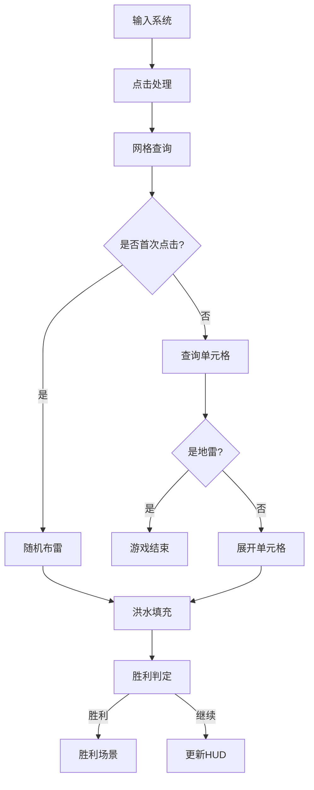
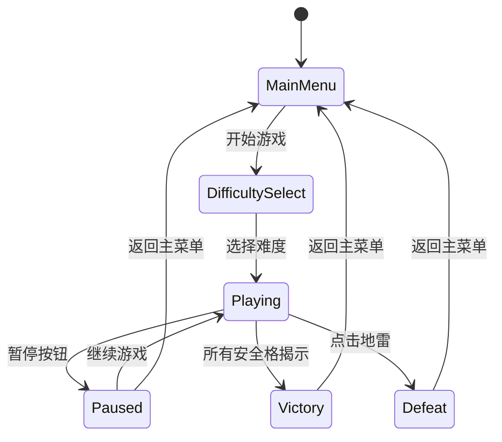

# 扫雷游戏 - 基于Rust与Bevy引擎(v0.18.1)技术架构与开发指南

> **文档版本**: v1.1
> **适用引擎**: Bevy 0.18.1 (最新稳定版)
> **语言版本**: Rust 2024 Edition
> **文档状态**: 正式版

---

## 目录

1. [项目初始化与依赖配置](#1-项目初始化与依赖配置)
2. [标准化文件目录结构](#2-标准化文件目录结构)
3. [ECS架构设计](#3-ecs架构设计)
4. [核心玩法实现方案](#4-核心玩法实现方案)
5. [状态机与场景管理](#5-状态机与场景管理)
6. [UI与交互系统](#6-ui与交互系统)
7. [性能优化与内存管理](#7-性能优化与内存管理)
8. [测试策略](#8-测试策略)
9. [构建与跨平台发布](#9-构建与跨平台发布)
10. [常见开发陷阱与最佳实践](#10-常见开发陷阱与最佳实践)

---

## 1. 项目初始化与依赖配置

### 1.1 Cargo.toml 核心配置

```toml
[package]
name = "minesweeper"
version = "0.1.0"
edition = "2024"
authors = ["Your Name"]
description = "A Minesweeper game built with Rust and Bevy"

[features]
default = ["dev-dynamic-linking"]
dev-dynamic-linking = ["bevy/dynamic_linking"]

[dependencies]
# 核心游戏引擎
bevy = "0.18.1"

# 随机数生成
rand = "0.9"

# 音频处理（可选，Bevy已内置基础音频支持）
bevy_kira_audio = "0.23"

# 序列化支持（用于存档/读档）
serde = { version = "1.0", features = ["derive"] }
serde_json = "1.0"

# 日志系统
tracing = "0.1"
tracing-subscriber = { version = "0.3", features = ["env-filter"] }

[dev-dependencies]
# 测试工具
bevy = { version = "0.18.1", features = ["dynamic_linking"] }

[profile.dev]
opt-level = 1
debug = true

[profile.dev.package."*"]
opt-level = 3

[profile.release]
lto = "thin"
codegen-units = 1
strip = true
panic = "abort"
```

### 1.2 关键依赖说明

| 依赖 | 版本 | 用途 |
|------|------|------|
| `bevy` | 0.18.1 | 核心ECS游戏引擎 |
| `rand` | 0.9 | 随机布雷算法 |
| `bevy_kira_audio` | 0.23 | 高级音频管理 |
| `serde` | 1.0 | 游戏状态序列化 |
| `tracing` | 0.1 | 结构化日志 |

### 1.3 开发环境要求

- **Rust**: 1.80+ (推荐最新稳定版)
- **操作系统**: Windows 10+, macOS 12+, Linux (支持Vulkan/Metal)
- **构建工具**: `cargo`, `rustup`
- **WebAssembly**: `wasm-pack`, `wasm-bindgen-cli`

---

## 2. 标准化文件目录结构

### 2.1 目录树

```
minesweeper/
├── Cargo.toml
├── Cargo.lock
├── README.md
├── LICENSE
├── assets/                      # 游戏资源文件
│   ├── audio/
│   │   ├── click.ogg
│   │   ├── explode.ogg
│   │   ├── victory.ogg
│   │   └── bgm.ogg
│   ├── fonts/
│   │   └── main.ttf
│   └── textures/
│       └── tiles.png
├── src/
│   ├── main.rs                  # 入口点与App初始化
│   ├── lib.rs                   # 库导出（可选）
│   ├── core/                    # 核心模块
│   │   ├── mod.rs
│   │   ├── components.rs        # ECS组件定义
│   │   ├── resources.rs         # 全局资源定义
│   │   └── events.rs            # 事件定义
│   ├── game/                    # 游戏逻辑模块
│   │   ├── mod.rs
│   │   ├── grid.rs              # 网格系统
│   │   ├── minefield.rs         # 雷场管理
│   │   ├── flood_fill.rs        # 洪水填充算法
│   │   └── rules.rs             # 游戏规则与判定
│   ├── state/                   # 状态机模块
│   │   ├── mod.rs
│   │   ├── game_state.rs        # 游戏状态定义
│   │   └── scene_manager.rs     # 场景管理
│   ├── ui/                      # UI模块
│   │   ├── mod.rs
│   │   ├── hud.rs               # HUD界面
│   │   ├── menu.rs              # 菜单系统
│   │   └── grid_renderer.rs     # 网格渲染
│   ├── systems/                 # 系统模块
│   │   ├── mod.rs
│   │   ├── input.rs             # 输入处理
│   │   ├── game_logic.rs        # 游戏逻辑系统
│   │   ├── timer.rs             # 计时器系统
│   │   └── audio.rs             # 音频系统
│   └── utils/                   # 工具模块
│       ├── mod.rs
│       └── helpers.rs
├── tests/                       # 集成测试
│   ├── game_logic_test.rs
│   └── flood_fill_test.rs
└── benches/                     # 性能基准测试
    └── grid_benchmark.rs
```

### 2.2 模块职责划分

| 模块 | 职责 | 关键文件 |
|------|------|----------|
| `core` | 定义所有ECS组件、资源、事件 | [`components.rs`](src/core/components.rs), [`resources.rs`](src/core/resources.rs) |
| `game` | 实现核心游戏算法与规则 | [`grid.rs`](src/game/grid.rs), [`minefield.rs`](src/game/minefield.rs) |
| `state` | 管理游戏状态机与场景切换 | [`game_state.rs`](src/state/game_state.rs) |
| `ui` | 处理所有UI渲染与交互 | [`hud.rs`](src/ui/hud.rs), [`menu.rs`](src/ui/menu.rs) |
| `systems` | 注册到Bevy调度器的系统函数 | [`game_logic.rs`](src/systems/game_logic.rs) |
| `utils` | 通用工具函数与辅助方法 | [`helpers.rs`](src/utils/helpers.rs) |

---

## 3. ECS架构设计

### 3.1 核心组件定义

组件是ECS架构的数据单元，所有组件应仅包含数据，不包含逻辑。

#### 网格相关组件

```rust
/// 标记实体为网格单元格
#[derive(Component)]
pub struct Cell {
    pub row: u32,
    pub col: u32,
}

/// 标记单元格是否包含地雷
#[derive(Component)]
pub struct Mine {
    pub is_mine: bool,
}

/// 单元格状态枚举
#[derive(Component, Default)]
pub enum CellState {
    #[default]
    Hidden,
    Revealed,
    Flagged,
    Questioned,
}

/// 相邻地雷数量（0-8）
#[derive(Component, Default)]
pub struct AdjacentMineCount(pub u8);

/// 单元格视觉表现
#[derive(Component)]
pub struct CellSprite {
    pub texture_index: u32,
}
```

#### 游戏控制组件

```rust
/// 标记主相机
#[derive(Component)]
pub struct MainCamera;

/// 标记UI相机
#[derive(Component)]
pub struct UICamera;

/// 计时器组件
#[derive(Component)]
pub struct GameTimer {
    pub elapsed: f32,
}

/// 难度配置
#[derive(Component)]
pub struct DifficultyConfig {
    pub rows: u32,
    pub cols: u32,
    pub mine_count: u32,
}
```

### 3.2 全局资源管理

资源是全局单例，用于存储跨系统共享的数据。

```rust
/// 游戏配置资源
#[derive(Resource)]
pub struct GameConfig {
    pub grid_rows: u32,
    pub grid_cols: u32,
    pub total_mines: u32,
    pub cell_size: f32,
}

/// 游戏状态资源
#[derive(Resource, Default)]
pub struct GameState {
    pub status: GameStatus,
    pub elapsed_time: f32,
    pub flags_placed: u32,
    pub cells_revealed: u32,
}

/// 雷场数据资源
#[derive(Resource)]
pub struct MinefieldData {
    pub grid: Vec<Vec<CellData>>,
    pub first_click: bool,
}

/// 音频资源
#[derive(Resource)]
pub struct AudioHandles {
    pub click: Handle<AudioSource>,
    pub explode: Handle<AudioSource>,
    pub victory: Handle<AudioSource>,
    pub flag: Handle<AudioSource>,
}
```

### 3.3 系统划分与数据流向

#### 系统执行顺序

```
First                           # 预更新 - 输入处理
    └── input_system            # 处理用户输入

Update                          # 主更新循环
    ├── GameStateSet::First
    │   └── state_transition_system   # 状态机转换
    │
    ├── GameStateSet::Second
    │   ├── grid_click_system         # 处理点击
    │   ├── flood_fill_system         # 展开空白区域
    │   └── flag_toggle_system        # 标记/取消标记
    │
    ├── GameStateSet::Third
    │   ├── win_condition_system      # 胜利判定
    │   ├── lose_condition_system     # 失败判定
    │   └── timer_update_system       # 更新计时器
    │
    └── GameStateSet::Fourth
        ├── cell_visual_update_system # 更新视觉表现
        └── hud_update_system         # 更新HUD

Last                            # 后更新 - 清理工作
    └── camera_follow_system    # 相机跟随（如有）
```

#### 自定义调度集合

```rust
#[derive(SystemSet, Debug, Clone, PartialEq, Eq, Hash)]
pub enum GameStateSet {
    First,
    Second,
    Third,
    Fourth,
}

// 注册调度集合
app.configure_sets(
    Update,
    (
        GameStateSet::First,
        GameStateSet::Second,
        GameStateSet::Third,
        GameStateSet::Fourth,
    ).chain()
);
```

#### 数据流向图



---

## 4. 核心玩法实现方案

### 4.1 网格初始化

网格采用二维向量存储，每个单元格对应一个实体。

```rust
pub fn initialize_grid(
    commands: &mut Commands,
    config: &GameConfig,
) -> Entity {
    let grid_parent = commands.spawn_empty().id();
    
    for row in 0..config.grid_rows {
        for col in 0..config.grid_cols {
            let cell_entity = commands.spawn((
                Cell { row, col },
                CellState::Hidden,
                AdjacentMineCount(0),
                Mine { is_mine: false },
                Transform::from_xyz(
                    col as f32 * config.cell_size,
                    -row as f32 * config.cell_size,
                    0.0,
                ),
            )).id();
            
            commands.entity(grid_parent).add_child(cell_entity);
        }
    }
    
    grid_parent
}
```

### 4.2 随机布雷算法

采用Fisher-Yates洗牌算法确保地雷分布均匀随机。

```rust
pub fn place_mines(
    commands: &mut Commands,
    config: &GameConfig,
    safe_zone: Option<(u32, u32)>, // 首次点击安全区域
) -> Vec<(u32, u32)> {
    let total_cells = (config.grid_rows * config.grid_cols) as usize;
    let mut indices: Vec<usize> = (0..total_cells).collect();
    
    // 排除安全区域
    if let Some((safe_row, safe_col)) = safe_zone {
        let safe_indices = get_neighbors(safe_row, safe_col, config);
        indices.retain(|&i| {
            let (r, c) = (i / config.grid_cols as usize, i % config.grid_cols as usize);
            !safe_indices.contains(&(r as u32, c as u32))
        });
    }
    
    // Fisher-Yates洗牌
    let mut rng = rand::rng();
    for i in (1..indices.len()).rev() {
        let j = rng.random_range(0..=i);
        indices.swap(i, j);
    }
    
    // 取前mine_count个位置布雷
    let mine_positions: Vec<(u32, u32)> = indices[..config.total_mines as usize]
        .iter()
        .map(|&i| (
            (i / config.grid_cols as usize) as u32,
            (i % config.grid_cols as usize) as u32,
        ))
        .collect();
    
    mine_positions
}
```

### 4.3 安全区域洪水填充展开

使用迭代式洪水填充算法，避免递归导致的栈溢出。

```rust
pub fn flood_fill_reveal(
    commands: &mut Commands,
    start_row: u32,
    start_col: u32,
    config: &GameConfig,
    minefield: &mut MinefieldData,
) -> Vec<(u32, u32)> {
    let mut revealed = Vec::new();
    let mut stack = vec![(start_row, start_col)];
    
    while let Some((row, col)) = stack.pop() {
        // 边界检查
        if row >= config.grid_rows || col >= config.grid_cols {
            continue;
        }
        
        let cell = &mut minefield.grid[row as usize][col as usize];
        
        // 已揭示或标记的跳过
        if cell.state == CellState::Revealed || cell.state == CellState::Flagged {
            continue;
        }
        
        // 揭示当前单元格
        cell.state = CellState::Revealed;
        revealed.push((row, col));
        
        // 如果相邻雷数为0，继续展开
        if cell.adjacent_mines == 0 {
            for (nr, nc) in get_neighbors(row, col, config) {
                stack.push((nr, nc));
            }
        }
    }
    
    revealed
}
```

### 4.4 胜负判定逻辑

```rust
/// 胜利条件：所有非雷单元格均已揭示
pub fn check_victory(
    config: &GameConfig,
    minefield: &MinefieldData,
) -> bool {
    let total_safe_cells = (config.grid_rows * config.grid_cols - config.total_mines) as usize;
    let revealed_count = minefield.grid.iter()
        .flat_map(|row| row.iter())
        .filter(|cell| cell.state == CellState::Revealed)
        .count();
    
    revealed_count == total_safe_cells
}

/// 失败条件：点击到地雷
pub fn check_defeat(cell: &CellData) -> bool {
    cell.is_mine && cell.state == CellState::Revealed
}
```

### 4.5 计时器与剩余雷数计算

```rust
pub fn update_timer_system(
    time: Res<Time>,
    mut game_state: ResMut<GameState>,
) {
    if game_state.status == GameStatus::Playing {
        game_state.elapsed_time += time.delta_secs();
    }
}

pub fn update_remaining_mines_system(
    config: Res<GameConfig>,
    game_state: Res<GameState>,
    mut hud_text: Query<&mut Text, With<RemainingMinesText>>,
) {
    let remaining = config.total_mines - game_state.flags_placed;
    // 更新HUD显示
}
```

---

## 5. 状态机与场景管理

### 5.1 游戏状态定义 (Bevy 0.18 States API)

Bevy 0.18提供了内置的状态管理API，推荐使用`States` trait。

```rust
use bevy::prelude::*;

/// 游戏状态枚举 (实现States trait用于状态管理)
#[derive(States, Debug, Clone, Copy, PartialEq, Eq, Hash, Default)]
pub enum GameStatus {
    #[default]
    MainMenu,
    DifficultySelect,
    Playing,
    Paused,
    Victory,
    Defeat,
}
```

### 5.2 状态转换系统 (Bevy 0.18 NextState API)

使用Bevy内置的`NextState`资源进行状态转换。

```rust
use bevy::prelude::*;

/// 状态转换系统 (Bevy 0.18推荐方式)
pub fn handle_pause_input(
    keyboard: Res<ButtonInput<KeyCode>>,
    mut next_state: ResMut<NextState<GameStatus>>,
) {
    // 按P键切换到暂停状态
    if keyboard.just_pressed(KeyCode::KeyP) {
        next_state.set(GameStatus::Paused);
    }
}

/// 注册状态转换系统
app.add_systems(Update, handle_pause_input.run_if(in_state(GameStatus::Playing)));
```

> **Bevy 0.18状态API说明**:
> - `State<S>`: 自动管理的当前状态资源
> - `NextState<S>`: 用于请求状态转换
> - `OnEnter(S)`: 进入状态时运行的调度
> - `OnExit(S)`: 退出状态时运行的调度
> - `OnTransition(S1, S2)`: 特定状态转换时运行
> - `in_state(S)`: 系统运行条件

### 5.3 场景管理 (使用OnEnter/OnExit)

```rust
use bevy::prelude::*;

/// 标记场景实体
#[derive(Component)]
pub struct SceneMarker;

/// 主菜单场景设置
pub fn setup_main_menu(
    mut commands: Commands,
    asset_server: Res<AssetServer>,
) {
    // 生成2D相机 (Bevy 0.18语法)
    commands.spawn((
        Camera2d,  // Bevy 0.18: Camera2d组件
        MainCamera,
    ));
    
    // UI按钮、标题等
    commands.spawn((
        SceneMarker,
        // ... UI组件
    ));
}

/// 清理场景
pub fn cleanup_scene(
    mut commands: Commands,
    query: Query<Entity, With<SceneMarker>>,
) {
    for entity in query.iter() {
        commands.entity(entity).despawn_recursive();
    }
}

/// 注册场景进入/退出系统
app.add_systems(OnEnter(GameStatus::MainMenu), setup_main_menu);
app.add_systems(OnExit(GameStatus::MainMenu), cleanup_scene);
app.add_systems(OnEnter(GameStatus::Playing), setup_game_scene);
app.add_systems(OnExit(GameStatus::Playing), cleanup_game);
```

### 5.4 状态切换流程图



---

## 6. UI与交互系统

### 6.1 网格渲染系统 (Bevy 0.18 UI API)

> **Bevy 0.18 UI变更**: `ImageNode`替代了旧的`UiImage`，`Node`替代了`Style`。

```rust
use bevy::prelude::*;

pub fn grid_render_system(
    mut commands: Commands,
    config: Res<GameConfig>,
    cells: Query<(Entity, &Cell, &CellState), Added<Cell>>,
    asset_server: Res<AssetServer>,
) {
    let texture = asset_server.load("textures/tiles.png");
    
    for (entity, cell, state) in cells.iter() {
        commands.entity(entity).insert((
            Node {
                width: Val::Px(config.cell_size),
                height: Val::Px(config.cell_size),
                ..default()
            },
            ImageNode::new(texture.clone()),
            *state,
        ));
    }
}
```

### 6.2 鼠标事件处理 (Bevy 0.18 Input API)

> **Bevy 0.18 Input API**:
> - `ButtonInput<MouseButton>`替代了旧的`Input<MouseButton>`
> - `just_pressed()`: 按键刚按下时返回true
> - `pressed()`: 按键持续按下时返回true
> - `just_released()`: 按键刚释放时返回true

```rust
use bevy::prelude::*;

pub fn handle_cell_click_system(
    mouse_button_input: Res<ButtonInput<MouseButton>>,
    windows: Query<&Window>,
    cameras: Query<(&Camera, &GlobalTransform), With<MainCamera>>,
    cells: Query<(Entity, &Cell, &CellState)>,
    mut click_events: EventWriter<CellClickEvent>,
) {
    // 检测鼠标左键刚按下
    if mouse_button_input.just_pressed(MouseButton::Left) {
        let window = windows.single();
        let (camera, camera_transform) = cameras.single();
        
        if let Some(cursor_pos) = window.cursor_position() {
            if let Ok(world_pos) = camera.viewport_to_world_2d(&camera_transform, cursor_pos) {
                // 查询点击的单元格
                for (entity, cell, _state) in cells.iter() {
                    if is_point_in_cell(world_pos, cell, &config) {
                        click_events.send(CellClickEvent {
                            entity,
                            row: cell.row,
                            col: cell.col,
                            button: MouseButton::Left,
                        });
                    }
                }
            }
        }
    }
}

#[derive(Event)]
pub struct CellClickEvent {
    pub entity: Entity,
    pub row: u32,
    pub col: u32,
    pub button: MouseButton,
}
```

### 6.3 音效触发系统 (Bevy 0.18 Audio API)

> **Bevy 0.18 Audio**: 使用`ResMut<Audio>`的`play()`方法播放音效。

```rust
use bevy::prelude::*;

pub fn audio_trigger_system(
    mut click_reader: EventReader<CellClickEvent>,
    audio_handles: Res<AudioHandles>,
    mut audio: ResMut<Audio>,
) {
    for event in click_reader.read() {
        match event.button {
            MouseButton::Left => {
                // 播放点击音效
                audio.play(audio_handles.click.clone());
            }
            MouseButton::Right => {
                // 播放标记音效
                audio.play(audio_handles.flag.clone());
            }
        }
    }
}
```

### 6.4 基础动画

```rust
#[derive(Component)]
pub struct RevealAnimation {
    pub progress: f32,
    pub duration: f32,
}

pub fn animate_reveal_system(
    time: Res<Time>,
    mut animations: Query<(&mut RevealAnimation, &mut Transform)>,
) {
    for (mut anim, mut transform) in animations.iter_mut() {
        anim.progress += time.delta_secs();
        let scale = anim.progress / anim.duration;
        
        if scale <= 1.0 {
            let eased = ease_out_cubic(scale);
            transform.scale = Vec3::splat(eased);
        }
    }
}

fn ease_out_cubic(t: f32) -> f32 {
    1.0 - (1.0 - t).powi(3)
}
```

---

## 7. 性能优化与内存管理

### 7.1 实体生命周期控制

```rust
/// 使用EntityBundle批量创建实体
#[derive(Bundle)]
pub struct CellBundle {
    pub cell: Cell,
    pub state: CellState,
    pub sprite: CellSprite,
    pub transform: Transform,
    pub visibility: Visibility,
}

/// 游戏结束时批量清理实体
pub fn cleanup_game_entities(
    mut commands: Commands,
    game_entities: Query<Entity, With<GameMarker>>,
) {
    for entity in game_entities.iter() {
        commands.entity(entity).despawn_recursive();
    }
}
```

### 7.2 系统执行顺序优化 (Bevy 0.18 API)

```rust
// 使用系统集合确保执行顺序
app.configure_sets(
    Update,
    (
        InputSet::Process,
        GameSet::Logic,
        GameSet::WinCheck,
        UISet::Update,
    ).chain()
);

// 使用run_if条件避免不必要的系统执行
app.add_systems(
    Update,
    (
        update_timer_system.run_if(in_state(GameStatus::Playing)),
        render_victory_screen.run_if(in_state(GameStatus::Victory)),
    )
);

// 使用.after()和.before()指定系统间依赖
app.add_systems(
    Update,
    (
        update_system_one,
        update_system_two.after(update_system_one),
        update_system_three.after(update_system_two),
    ),
);
```

### 7.3 避免资源竞争与查询冲突

```rust
// 使用ParamSet避免同一帧内对同一数据的可变/不可变访问冲突
pub fn safe_grid_access_system(
    mut params: ParamSet<(
        Query<&Cell>,           // 只读查询
        Query<&mut CellState>,  // 可变查询
    )>,
) {
    // 先只读访问
    for cell in params.p0().iter() {
        // ...
    }
    
    // 后可变访问
    for mut state in params.p1().iter_mut() {
        // ...
    }
}

// 使用With/Without过滤器减少查询范围
fn optimized_query(
    hidden_cells: Query<&Cell, (With<CellState>, Without<RevealedMarker>)>,
) {
    // 只查询未揭示的单元格
}
```

### 7.4 内存池模式

```rust
#[derive(Resource)]
pub struct EntityPool {
    pool: Vec<Entity>,
}

impl EntityPool {
    pub fn acquire(&mut self) -> Option<Entity> {
        self.pool.pop()
    }
    
    pub fn release(&mut self, entity: Entity) {
        self.pool.push(entity);
    }
}
```

> **Bevy 0.18查询优化**: 使用`world.query::<T>()`创建可复用的`QueryState`，避免每次系统调用时重新创建查询。

---

## 8. 测试策略

### 8.1 单元测试

```rust
#[cfg(test)]
mod tests {
    use super::*;
    
    #[test]
    fn test_fisher_yates_mine_placement() {
        let config = GameConfig {
            grid_rows: 9,
            grid_cols: 9,
            total_mines: 10,
            cell_size: 32.0,
        };
        
        let mines = place_mines(&mut Commands::default(), &config, None);
        
        assert_eq!(mines.len(), 10);
        // 验证无重复位置
        let unique: std::collections::HashSet<_> = mines.iter().collect();
        assert_eq!(unique.len(), 10);
    }
    
    #[test]
    fn test_flood_fill_empty_area() {
        // 测试空白区域展开
        let mut minefield = create_test_minefield(5, 5);
        minefield.grid[2][2].adjacent_mines = 0;
        
        let revealed = flood_fill_reveal(
            &mut Commands::default(),
            2, 2,
            &GameConfig::default(),
            &mut minefield,
        );
        
        assert!(!revealed.is_empty());
    }
    
    #[test]
    fn test_victory_condition() {
        let config = GameConfig {
            grid_rows: 5,
            grid_cols: 5,
            total_mines: 3,
            ..default()
        };
        
        let mut minefield = create_test_minefield(5, 5);
        // 设置所有非雷单元格为已揭示
        for row in minefield.grid.iter_mut() {
            for cell in row.iter_mut() {
                if !cell.is_mine {
                    cell.state = CellState::Revealed;
                }
            }
        }
        
        assert!(check_victory(&config, &minefield));
    }
}
```

### 8.2 集成测试

```rust
#[cfg(test)]
mod integration_tests {
    use bevy::prelude::*;
    
    #[test]
    fn test_full_game_flow() {
        let mut app = App::new();
        
        // 添加必要的插件
        app.add_plugins(MinimalPlugins);
        app.add_plugins(bevy::asset::AssetPlugin::default());
        
        // 注册资源和系统
        app.insert_resource(GameConfig::beginner());
        app.add_systems(Update, game_logic_system);
        
        // 模拟游戏流程
        app.update();
        
        // 验证状态
        let state = app.world().get_resource::<GameState>().unwrap();
        assert_eq!(state.status, GameStatus::Playing);
    }
}
```

### 8.3 Bevy内置测试工具

```rust
use bevy::ecs::system::SystemState;
use bevy::prelude::*;

#[test]
fn test_system_with_world() {
    let mut world = World::new();
    world.insert_resource(GameConfig::beginner());
    
    // Bevy 0.18: 使用SystemState高效测试系统
    let mut system_state: SystemState<(
        Res<GameConfig>,
        Query<&Cell>,
    )> = SystemState::new(&mut world);
    
    let (config, cells) = system_state.get(&world);
    assert_eq!(config.grid_rows, 9);
}

// 使用QueryState进行高效查询测试
#[test]
fn test_query_state() {
    let mut world = World::new();
    
    // 生成测试实体
    world.spawn((Cell { row: 0, col: 0 }, CellState::Hidden));
    world.spawn((Cell { row: 1, col: 0 }, CellState::Revealed));
    
    // 创建可复用的QueryState
    let mut query_state = world.query::<(&Cell, &CellState)>();
    let results: Vec<_> = query_state.iter(&world).collect();
    
    assert_eq!(results.len(), 2);
}
```

---

## 9. 构建与跨平台发布

### 9.1 Windows构建

```bash
# 安装MSVC工具链
rustup toolchain install stable-msvc

# 构建发布版本
cargo build --release

# 输出位置
# target/release/minesweeper.exe
```

### 9.2 macOS构建

```bash
# 安装Xcode Command Line Tools
xcode-select --install

# 构建Universal Binary（可选）
rustup target add x86_64-apple-darwin
rustup target add aarch64-apple-darwin

cargo build --release --target x86_64-apple-darwin
cargo build --release --target aarch64-apple-darwin

# 创建App Bundle
mkdir -p Minesweeper.app/Contents/MacOS
cp target/release/minesweeper Minesweeper.app/Contents/MacOS/
```

### 9.3 Linux构建

```bash
# 安装依赖
sudo apt-get install \
    pkg-config \
    libx11-dev \
    libasound2-dev \
    libudev-dev \
    libwayland-dev \
    libxkbcommon-dev

# 构建
cargo build --release
```

### 9.4 WebAssembly构建

```bash
# 安装wasm目标
rustup target add wasm32-unknown-unknown

# 安装wasm-bindgen-cli
cargo install wasm-bindgen-cli

# 构建
cargo build --release --target wasm32-unknown-unknown

# 生成JS绑定
wasm-bindgen --out-dir pkg --target web \
    target/wasm32-unknown-unknown/release/minesweeper.wasm

# 使用基本HTML加载
```

### 9.5 发布检查清单

| 检查项 | Windows | macOS | Linux | WASM |
|--------|---------|-------|-------|------|
| 依赖库打包 | ✓ | ✓ | ✓ | N/A |
| 资源文件路径 | ✓ | ✓ | ✓ | ✓ |
| 性能分析 | ✓ | ✓ | ✓ | ✓ |
| 内存泄漏检查 | ✓ | ✓ | ✓ | ✓ |
| 跨平台测试 | ✓ | ✓ | ✓ | ✓ |

---

## 10. 常见开发陷阱与最佳实践

### 10.1 常见陷阱

#### 陷阱1: 组件查询冲突

```rust
// 错误示例：同一系统内对同一组件的可变和不可变查询
fn bad_system(
    cells: Query<&Cell>,           // 不可变
    mut states: Query<&mut CellState>, // 可变，可能冲突
) { }

// 正确示例：使用ParamSet或拆分系统
fn good_system(
    mut params: ParamSet<(
        Query<&Cell>,
        Query<&mut CellState>,
    )>,
) { }
```

#### 陷阱2: 资源初始化顺序

```rust
// 错误：在资源未初始化时访问
fn bad_startup(
    config: Res<GameConfig>, // 可能未插入
) { }

// 正确：使用Option或确保初始化顺序
fn good_startup(
    config: Option<Res<GameConfig>>,
) {
    if let Some(config) = config {
        // 安全访问
    }
}
```

#### 陷阱3: 事件未正确消费

> **Bevy 0.18事件API**: `EventReader::read()`返回未读事件的迭代器并标记为已读。

```rust
// 错误：使用iter()而非read()
fn bad_event_system(
    mut events: EventReader<CellClickEvent>,
) {
    for event in events.iter() { // 应该用events.read()
        // ...
    }
}

// 正确 (Bevy 0.18)
fn good_event_system(
    mut events: EventReader<CellClickEvent>,
) {
    for event in events.read() {
        // ...
    }
}
```

### 10.2 Bevy生态最佳实践

#### 1. 组件设计原则

- 组件应仅包含数据，不包含逻辑
- 保持组件尽可能小和专注
- 使用标记组件代替布尔标志

```rust
// 推荐：使用标记组件
#[derive(Component)]
pub struct IsRevealed;

// 不推荐：在组件中使用布尔标志
#[derive(Component)]
pub struct Cell {
    pub is_revealed: bool, // 避免这样做
}
```

#### 2. 系统调度优化 (Bevy 0.18)

```rust
// 使用run_if避免不必要的系统执行
app.add_systems(
    Update,
    update_timer_system.run_if(in_state(GameStatus::Playing))
);

// 使用chain确保执行顺序
app.configure_sets(
    Update,
    (system_a, system_b, system_c).chain()
);

// 使用.after()和.before()指定系统间依赖
app.add_systems(
    Update,
    (
        system_a,
        system_b.after(system_a),
        system_c.after(system_b),
    ),
);
```

#### 3. 资源管理

```rust
// 使用Local避免全局资源竞争
fn counter_system(
    mut local_counter: Local<u32>,
) {
    *local_counter += 1;
}

// 使用NonSend处理非Send资源
fn non_send_system(
    mut non_send: NonSendMut<SomeNonSendResource>,
) { }
```

#### 4. 资产加载

```rust
// 预加载资产
#[derive(Resource)]
pub struct PreloadedAssets {
    pub tile_texture: Handle<Image>,
    pub font: Handle<Font>,
}

fn preload_assets(
    asset_server: Res<AssetServer>,
) -> PreloadedAssets {
    PreloadedAssets {
        tile_texture: asset_server.load("textures/tiles.png"),
        font: asset_server.load("fonts/main.ttf"),
    }
}

// 使用AssetEvent监听加载完成
fn asset_load_monitor(
    mut events: EventReader<AssetEvent<Image>>,
) {
    for event in events.read() {
        match event {
            AssetEvent::Added { id } => {
                // 资产加载完成
            }
            _ => {}
        }
    }
}
```

### 10.3 调试技巧

```rust
// 启用Bevy日志
use tracing::{info, warn, error};

fn debug_system(
    cells: Query<&Cell>,
) {
    info!("Total cells: {}", cells.iter().count());
}

// 使用Bevy的调试渲染
fn debug_render_system(
    mut gizmos: Gizmos,
    config: Res<GameConfig>,
) {
    // 绘制网格边界
    gizmos.rect_2d(
        Vec2::ZERO,
        Vec2::new(
            config.grid_cols as f32 * config.cell_size,
            config.grid_rows as f32 * config.cell_size,
        ),
        Color::WHITE,
    );
}
```

### 10.4 性能分析工具

| 工具 | 用途 | 集成方式 |
|------|------|----------|
| `bevy_mod_debugdump` | 可视化系统调度图 | `app.add_plugins(DebugDumpPlugin)` |
| `tracing-tracy` | 实时性能分析 | 启用feature |
| `cargo-expand` | 查看宏展开 | `cargo install cargo-expand` |
| `heaptrack` | 内存分析 | 系统级工具 |

---

## 附录

### A. 难度配置参考

| 难度 | 行数 | 列数 | 雷数 |
|------|------|------|------|
| 初级 | 9 | 9 | 10 |
| 中级 | 16 | 16 | 40 |
| 高级 | 16 | 30 | 99 |

### B. 常用Bevy命令速查

```bash
# 开发运行
cargo run

# 发布构建
cargo build --release

# 运行测试
cargo test

# 性能分析
cargo run --release --features bevy/trace

# 清理构建缓存
cargo clean
```

### C. 相关资源

- [Bevy官方文档](https://bevyengine.org/learn/)
- [Bevy Examples](https://bevyengine.org/examples/)
- [Bevy Cheat Book](https://bevy-cheatbook.github.io/)
- [Rust Book](https://doc.rust-lang.org/book/)

---

*文档结束 - 如有疑问请参考Bevy官方文档或提交Issue*
