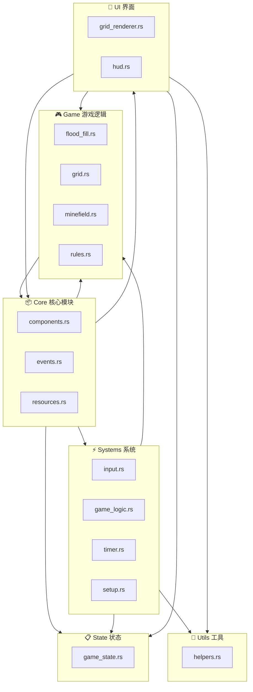
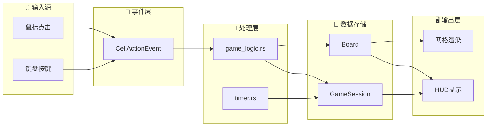
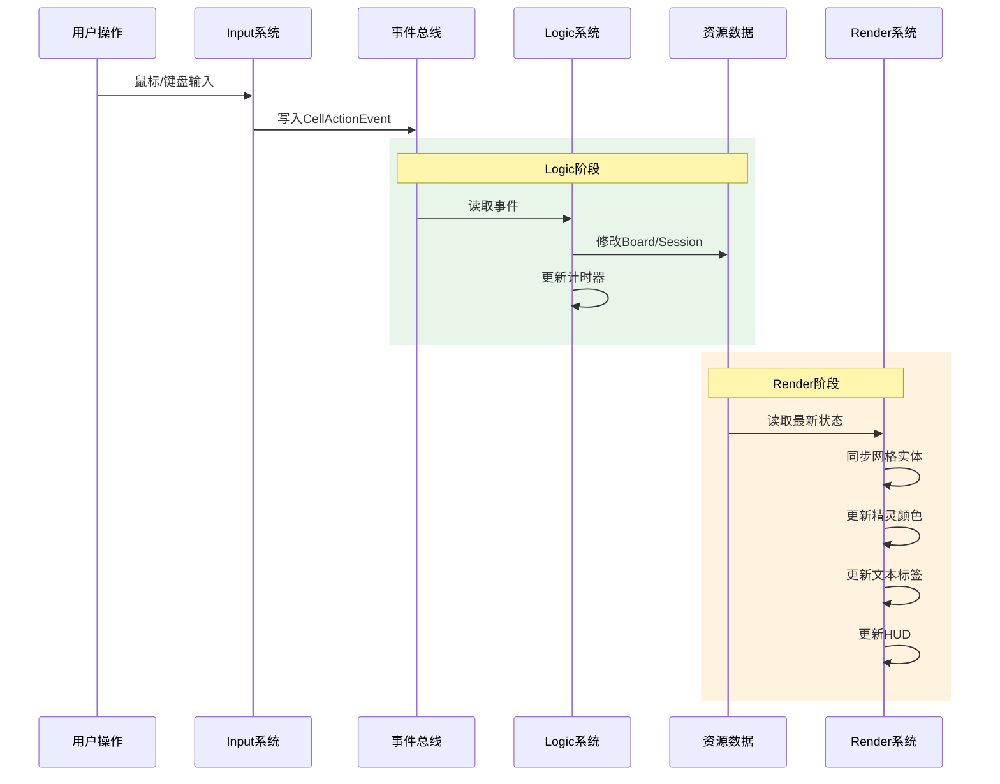
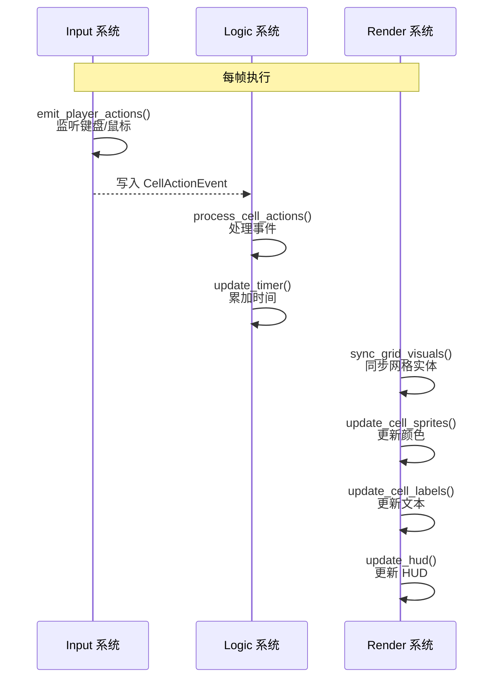
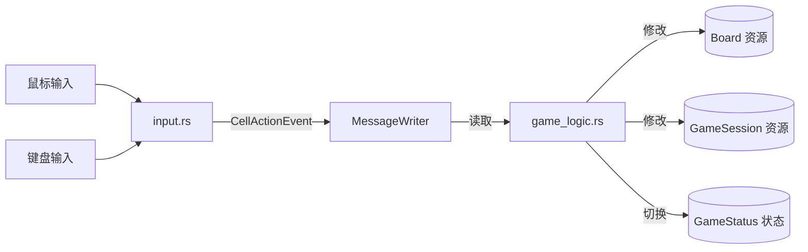
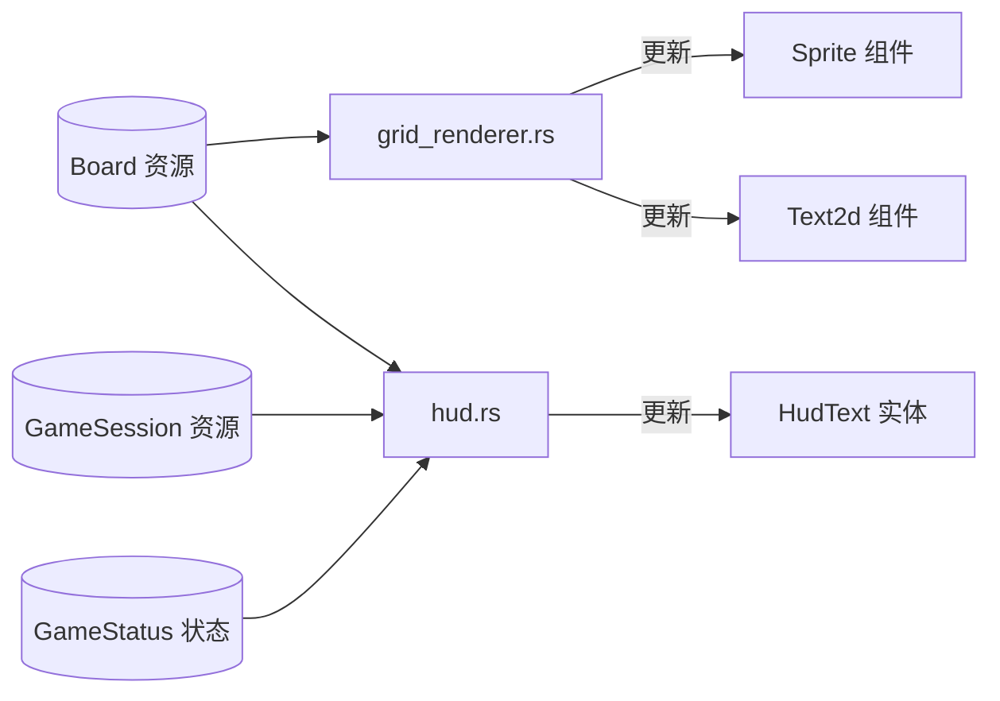

# 扫雷游戏 (Minesweeper) 技术架构文档

## 1. 项目概述

本项目是一个使用 Rust 语言和 Bevy 游戏引擎开发的经典扫雷游戏。项目采用 ECS（Entity-Component-System）架构模式，实现了完整的扫雷游戏逻辑，包括多种难度级别、计时器、旗帜标记、连通区域自动展开等功能。

### 1.1 技术栈

| 技术 | 版本 | 用途 |
|------|------|------|
| Rust | 2024 Edition | 主要编程语言 |
| Bevy | 0.18.1 | 游戏引擎，提供 ECS 框架、渲染、输入处理等 |
| rand | 0.9 | 随机数生成，用于地雷布置 |

### 1.2 项目特性

- **三种难度级别**：初级 (9x9, 10雷)、中级 (16x16, 40雷)、专家 (16x30, 99雷)
- **首次点击安全**：确保第一次点击的位置及其周围不会有地雷
- **连通区域自动展开**：点击空白区域时自动展开所有相连的安全区域
- **实时 HUD 显示**：显示难度、地雷数、旗帜数、剩余雷数、游戏时间等信息
- **键盘快捷键**：R 键重新开始，1/2/3 键切换难度

---

## 2. 项目结构

```
Minesweeper/
├── Cargo.toml                 # 项目配置与依赖管理
├── Cargo.lock                 # 依赖锁定文件
├── LICENSE                    # 许可证文件
├── .gitignore                 # Git 忽略配置
├── .cargo/                    # Cargo 配置目录
├── docs/
│   └── TECHNICAL_ARCHITECTURE.md  # 技术架构文档（本文件）
├── src/
│   ├── main.rs                # 程序入口点
│   ├── lib.rs                 # 库根，定义插件和系统注册
│   ├── core/                  # 核心模块：组件、事件、资源
│   │   ├── mod.rs
│   │   ├── components.rs      # ECS 组件定义
│   │   ├── events.rs          # 事件定义
│   │   └── resources.rs       # ECS 资源定义
│   ├── game/                  # 游戏逻辑模块
│   │   ├── mod.rs
│   │   ├── flood_fill.rs      # 连通区域展开算法
│   │   ├── grid.rs            # 网格视觉创建
│   │   ├── minefield.rs       # 地雷布置算法
│   │   └── rules.rs           # 游戏规则（胜负判定）
│   ├── state/                 # 状态管理模块
│   │   ├── mod.rs
│   │   ├── game_state.rs      # 游戏状态枚举
│   │   └── scene_manager.rs   # 场景管理（待实现）
│   ├── systems/               # 系统模块
│   │   ├── mod.rs
│   │   ├── audio.rs           # 音频系统（待实现）
│   │   ├── game_logic.rs      # 游戏逻辑处理系统
│   │   ├── input.rs           # 输入处理系统
│   │   ├── setup.rs           # 初始化设置系统
│   │   └── timer.rs           # 计时器系统
│   ├── ui/                    # 用户界面模块
│   │   ├── mod.rs
│   │   ├── grid_renderer.rs   # 网格渲染器
│   │   ├── hud.rs             # HUD（平视显示器）
│   │   └── menu.rs            # 菜单系统（待实现）
│   └── utils/                 # 工具模块
│       ├── mod.rs
│       └── helpers.rs         # 辅助函数
└── tests/
    └── game_flow_test.rs      # 集成测试
```

---

## 3. 架构设计

### 3.1 整体架构图

#### 3.1.1 模块依赖关系图



#### 3.1.2 数据流向图



#### 3.1.3 系统执行时序



### 3.2 ECS 架构说明

本项目采用 Bevy 的 ECS 架构模式：

- **Component（组件）**：纯数据容器，如 [`Cell`](../src/core/components.rs:4)、[`MainCamera`](../src/core/components.rs:16)、[`GridVisual`](../src/core/components.rs:19) 等
- **Entity（实体）**：组件的容器，通过 Entity ID 引用
- **System（系统）**：处理游戏逻辑的函数，如 [`emit_player_actions()`](../src/systems/input.rs:9)、[`process_cell_actions()`](../src/systems/game_logic.rs:10) 等
- **Resource（资源）**：全局共享数据，如 [`Board`](../src/core/resources.rs:70)、[`GameSession`](../src/core/resources.rs:179)、[`GameConfig`](../src/core/resources.rs:168) 等
- **Event（事件）**：系统间通信机制，如 [`CellActionEvent`](../src/core/events.rs:14)
- **State（状态）**：游戏状态机，如 [`GameStatus`](../src/state/game_state.rs:4)

---

## 4. 核心模块详解

### 4.1 核心模块 [`core/`](../src/core/mod.rs)

核心模块定义了游戏的基础数据结构，包括组件、事件和资源。

#### 4.1.1 组件 [`components.rs`](../src/core/components.rs)

| 组件名 | 作用 | 字段 |
|--------|------|------|
| [`Cell`](../src/core/components.rs:4) | 标记网格单元格实体 | `row: u32`, `col: u32` |
| [`MainCamera`](../src/core/components.rs:16) | 标记主相机实体 | 无 |
| [`GridVisual`](../src/core/components.rs:19) | 标记网格视觉元素 | 无 |
| [`CellLabel`](../src/core/components.rs:22) | 标记单元格文本标签 | `row: u32`, `col: u32` |
| [`HudText`](../src/core/components.rs:28) | 标记 HUD 文本实体 | 无 |

#### 4.1.2 事件 [`events.rs`](../src/core/events.rs)

事件系统使用 Bevy 的 Message 机制实现输入与逻辑的解耦。

**[`CellAction`](../src/core/events.rs:6) 枚举**：
- `Reveal { row, col }` - 揭开单元格
- `ToggleFlag { row, col }` - 切换旗帜标记
- `Restart` - 重新开始游戏
- `ChangeDifficulty(DifficultyPreset)` - 更改难度

**[`CellActionEvent`](../src/core/events.rs:14) 结构体**：
封装 `CellAction` 的 Message 类型，提供便捷的构造函数：
- [`reveal(row, col)`](../src/core/events.rs:19)
- [`toggle_flag(row, col)`](../src/core/events.rs:25)
- [`restart()`](../src/core/events.rs:31)
- [`change_difficulty(difficulty)`](../src/core/events.rs:37)

#### 4.1.3 资源 [`resources.rs`](../src/core/resources.rs)

资源是全局共享的游戏状态数据。

**[`CellVisibility`](../src/core/resources.rs:4) 枚举**：
- `Hidden` - 隐藏状态
- `Revealed` - 已揭开
- `Flagged` - 已标记旗帜

**[`CellData`](../src/core/resources.rs:11) 结构体**：
```rust
pub struct CellData {
    pub is_mine: bool,          // 是否为地雷
    pub adjacent_mines: u8,     // 周围地雷数量
    pub visibility: CellVisibility,  // 可见性状态
}
```

**[`DifficultyPreset`](../src/core/resources.rs:28) 枚举**：
| 难度 | 行数 | 列数 | 地雷数 |
|------|------|------|--------|
| Beginner | 9 | 9 | 10 |
| Intermediate | 16 | 16 | 40 |
| Expert | 16 | 30 | 99 |

**[`Board`](../src/core/resources.rs:70) 结构体**：
游戏棋盘数据，包含：
- `rows`, `cols`, `total_mines` - 棋盘尺寸
- `mines_placed` - 是否已布置地雷
- `cells: Vec<CellData>` - 单元格数据
- 关键方法：[`new()`](../src/core/resources.rs:79), [`reset()`](../src/core/resources.rs:91), [`cell()`](../src/core/resources.rs:122), [`cell_mut()`](../src/core/resources.rs:129), [`neighbors()`](../src/core/resources.rs:137), [`reveal_all_mines()`](../src/core/resources.rs:158)

**[`GameConfig`](../src/core/resources.rs:168) 结构体**：
游戏配置，当前包含 `cell_size: f32`（默认 32.0）

**[`GameSession`](../src/core/resources.rs:179) 结构体**：
游戏会话状态：
- `difficulty` - 当前难度
- `elapsed_seconds` - 已用时间
- `flags_placed` - 已放置旗帜数
- `revealed_safe_cells` - 已揭开的安全单元格数
- `first_click` - 是否首次点击
- `frozen` - 游戏是否冻结（胜利/失败后）

**[`CellEntityMap`](../src/core/resources.rs:209) 结构体**：
单元格坐标到 Entity 的映射表，用于快速查找。

---

### 4.2 游戏逻辑模块 [`game/`](../src/game/mod.rs)

#### 4.2.1 地雷布置 [`minefield.rs`](../src/game/minefield.rs)

**[`place_mines_with_safe_zone()`](../src/game/minefield.rs:5)**：
- 在棋盘上随机布置地雷
- 确保首次点击位置及其 3x3 邻域安全（无地雷）
- 当棋盘过于密集时，回退到仅排除点击位置本身
- 使用 Fisher-Yates 洗牌算法保证随机性

**[`recalculate_adjacent_counts()`](../src/game/minefield.rs:52)**：
- 重新计算每个单元格周围的地雷数量
- 遍历所有单元格，统计其 8 个邻居中的地雷数

#### 4.2.2 连通区域展开 [`flood_fill.rs`](../src/game/flood_fill.rs)

**[`reveal_connected_safe_area()`](../src/game/flood_fill.rs:5)**：
- 使用 BFS（广度优先搜索）算法展开连通的安全区域
- 从起始位置开始，递归展开所有 `adjacent_mines == 0` 的单元格
- 遇到数字边界（`adjacent_mines > 0`）时停止扩展
- 跳过已标记旗帜的单元格
- 返回新揭开的单元格数量

#### 4.2.3 游戏规则 [`rules.rs`](../src/game/rules.rs)

**[`check_defeat()`](../src/game/rules.rs:3)**：
- 当揭开的单元格是地雷时判定失败

**[`check_victory()`](../src/game/rules.rs:7)**：
- 当揭开的安全单元格数等于 `board.safe_cell_count()` 时判定胜利

**[`count_revealed_safe_cells()`](../src/game/rules.rs:11)**：
- 统计当前已揭开的非地雷单元格数量

#### 4.2.4 网格视觉 [`grid.rs`](../src/game/grid.rs)

**[`create_grid_visuals()`](../src/game/grid.rs:7)**：
- 为每个单元格创建 Sprite 实体和 Text2d 标签实体
- 调用 [`spawn_grid_lines()`](../src/game/grid.rs:57) 创建网格线

**[`despawn_grid_visuals()`](../src/game/grid.rs:51)**：
- 清除所有网格视觉实体

---

### 4.3 状态管理模块 [`state/`](../src/state/mod.rs)

#### 4.3.1 游戏状态 [`game_state.rs`](../src/state/game_state.rs)

**[`GameStatus`](../src/state/game_state.rs:4) 状态机**：
```rust
pub enum GameStatus {
    MainMenu,           // 主菜单
    DifficultySelect,   // 难度选择
    Playing,            // 游戏中（默认状态）
    Paused,             // 暂停
    Victory,            // 胜利
    Defeat,             // 失败
}
```

该枚举实现了 Bevy 的 `States` trait，用于状态驱动的系统执行控制。

---

### 4.4 系统模块 [`systems/`](../src/systems/mod.rs)

#### 4.4.1 系统集合 [`GameSet`](../src/systems/mod.rs:9)

```rust
pub enum GameSet {
    Input,   // 输入处理
    Logic,   // 游戏逻辑
    Render,  // 渲染更新
}
```

三个系统集合按顺序链式执行：`Input -> Logic -> Render`

#### 4.4.2 输入系统 [`input.rs`](../src/systems/input.rs)

**[`emit_player_actions()`](../src/systems/input.rs:9)**：
- 监听键盘输入：R 键重启、1/2/3 键切换难度
- 监听鼠标输入：左键揭开、右键标记旗帜
- 将屏幕坐标转换为网格坐标
- 写入 [`CellActionEvent`](../src/core/events.rs:14) 事件

#### 4.4.3 游戏逻辑系统 [`game_logic.rs`](../src/systems/game_logic.rs)

**[`process_cell_actions()`](../src/systems/game_logic.rs:10)**：
- 读取 [`CellActionEvent`](../src/core/events.rs:14) 事件
- 处理四种动作：
  - `Restart` / `ChangeDifficulty`：调用 [`reset_game()`](../src/systems/game_logic.rs:35) 重置游戏
  - `ToggleFlag`：调用 [`toggle_flag()`](../src/systems/game_logic.rs:48) 切换旗帜
  - `Reveal`：调用 [`reveal_cell()`](../src/systems/game_logic.rs:70) 揭开单元格

**[`reveal_cell()`](../src/systems/game_logic.rs:70) 流程**：
1. 检查游戏是否冻结或坐标越界
2. 检查单元格是否已标记或已揭开
3. 如果是首次点击，调用 [`place_mines_with_safe_zone()`](../src/game/minefield.rs:5) 布置地雷
4. 如果点击到地雷，揭开所有地雷并切换到 `Defeat` 状态
5. 如果点击到空白区域（`adjacent_mines == 0`），调用 [`reveal_connected_safe_area()`](../src/game/flood_fill.rs:5) 展开
6. 检查是否达到胜利条件

#### 4.4.4 计时器系统 [`timer.rs`](../src/systems/timer.rs)

**[`update_timer()`](../src/systems/timer.rs:6)**：
- 仅在 `GameStatus::Playing` 且未冻结时累加时间
- 使用 `time.delta_secs()` 获取帧间隔

#### 4.4.5 初始化系统 [`setup.rs`](../src/systems/setup.rs)

**[`setup_scene()`](../src/systems/setup.rs:5)**：
- 创建 2D 主相机
- 创建 HUD 文本实体

---

### 4.5 UI 模块 [`ui/`](../src/ui/mod.rs)

#### 4.5.1 网格渲染器 [`grid_renderer.rs`](../src/ui/grid_renderer.rs)

**[`sync_grid_visuals()`](../src/ui/grid_renderer.rs:7)**：
- 检查网格视觉实体数量是否匹配
- 不匹配时重建所有视觉实体

**[`update_cell_sprites()`](../src/ui/grid_renderer.rs:25)**：
- 根据单元格状态更新 Sprite 颜色：
  - 隐藏：灰色 `rgb(0.45, 0.45, 0.45)`
  - 旗帜：橙色 `rgb(0.95, 0.6, 0.15)`
  - 已揭开-地雷：红色 `rgb(0.85, 0.1, 0.1)`
  - 已揭开-空白：浅灰 `rgb(0.85, 0.85, 0.85)`
  - 已揭开-数字：中灰 `rgb(0.75, 0.75, 0.75)`

**[`update_cell_labels()`](../src/ui/grid_renderer.rs:47)**：
- 根据单元格状态更新文本标签：
  - 隐藏：空字符串
  - 旗帜：`"F"`
  - 地雷：`"*"`
  - 数字：显示 `adjacent_mines` 值
- 数字颜色根据值变化（1-4 各有不同颜色）

#### 4.5.2 HUD [`hud.rs`](../src/ui/hud.rs)

**[`update_hud()`](../src/ui/hud.rs:9)**：
- 显示格式：`Diff: {难度}  Mines: {总雷数}  Flags: {旗帜数}  Remaining: {剩余}  Time: {时间}s  Status: {状态}`
- 同时更新窗口标题
- 位置动态计算，位于棋盘上方

---

### 4.6 工具模块 [`utils/`](../src/utils/mod.rs)

#### 4.6.1 辅助函数 [`helpers.rs`](../src/utils/helpers.rs)

**[`board_dimensions()`](../src/utils/helpers.rs:5)**：
- 计算棋盘的像素尺寸

**[`cell_to_world_center()`](../src/utils/helpers.rs:12)**：
- 将网格坐标转换为世界空间中心坐标
- 用于创建单元格视觉元素

**[`world_to_cell()`](../src/utils/helpers.rs:22)**：
- 将世界空间坐标转换为网格坐标
- 用于鼠标点击命中检测

---

## 5. 插件注册与系统调度

### 5.1 [`MinesweeperPlugin`](../src/lib.rs:15)

主插件在 [`build()`](../src/lib.rs:18) 方法中完成所有初始化：

```rust
impl Plugin for MinesweeperPlugin {
    fn build(&self, app: &mut App) {
        // 1. 初始化状态
        app.init_state::<GameStatus>()
        
        // 2. 插入资源
            .insert_resource(GameConfig::default())
            .insert_resource(Board::new(initial_difficulty))
            .insert_resource(GameSession::new(initial_difficulty))
            .insert_resource(CellEntityMap::default())
        
        // 3. 注册事件
            .add_message::<CellActionEvent>()
        
        // 4. 配置系统集合
            .configure_sets(Update, (GameSet::Input, GameSet::Logic, GameSet::Render).chain())
        
        // 5. 注册系统
            .add_systems(Startup, systems::setup::setup_scene)
            .add_systems(Update, systems::input::emit_player_actions.in_set(GameSet::Input))
            .add_systems(Update, systems::game_logic::process_cell_actions.in_set(GameSet::Logic))
            .add_systems(Update, systems::timer::update_timer
                .run_if(in_state(GameStatus::Playing))
                .in_set(GameSet::Logic))
            .add_systems(Update, (
                ui::grid_renderer::sync_grid_visuals,
                ui::grid_renderer::update_cell_sprites,
                ui::grid_renderer::update_cell_labels,
                ui::hud::update_hud,
            ).chain().in_set(GameSet::Render));
    }
}
```

### 5.2 系统执行流程图



---

## 6. 数据流

### 6.1 输入到游戏逻辑的数据流



### 6.2 渲染数据流



---

## 7. 待实现模块

### 7.1 场景管理 [`scene_manager.rs`](../src/state/scene_manager.rs)

当前为空文件，计划实现：
- 不同游戏状态的场景切换逻辑
- 场景加载/卸载生命周期管理

### 7.2 音频系统 [`audio.rs`](../src/systems/audio.rs)

当前为空文件，计划实现：
- 点击音效
- 地雷爆炸音效
- 胜利/失败音效
- 背景音乐

### 7.3 菜单系统 [`menu.rs`](../src/ui/menu.rs)

当前为空文件，计划实现：
- 主菜单 UI
- 难度选择界面
- 暂停菜单
- 游戏结束弹窗

---

## 8. 测试

### 8.1 单元测试

各模块包含内联单元测试：

| 模块 | 测试内容 |
|------|----------|
| [`flood_fill.rs`](../src/game/flood_fill.rs:41) | 连通区域展开、边界处理、预揭开处理 |
| [`minefield.rs`](../src/game/minefield.rs:69) | 地雷数量、唯一性、安全区域、相邻计数 |
| [`rules.rs`](../src/game/rules.rs:19) | 胜负判定、安全单元格计数 |

### 8.2 集成测试

[`tests/game_flow_test.rs`](../tests/game_flow_test.rs) - 游戏流程集成测试

---

## 9. 构建配置

### 9.1 Cargo.toml 配置

```toml
[package]
name = "minesweeper"
version = "0.1.0"
edition = "2024"

[features]
default = ["dev-dynamic-linking"]
dev-dynamic-linking = ["bevy/dynamic_linking"]

[profile.dev]
opt-level = 1
debug = true

[profile.dev.package."*"]
opt-level = 3  # 依赖项优化

[profile.release]
lto = "thin"
codegen-units = 1
strip = true
panic = "abort"
```

### 9.2 构建命令

```bash
# 开发构建
cargo run

# 发布构建
cargo build --release

# 运行测试
cargo test
```

---

## 10. 扩展建议

1. **完善菜单系统**：实现 [`menu.rs`](../src/ui/menu.rs) 中的图形化菜单
2. **添加音效**：实现 [`audio.rs`](../src/systems/audio.rs) 中的音频反馈
3. **场景管理**：完善 [`scene_manager.rs`](../src/state/scene_manager.rs) 实现状态切换动画
4. **存档功能**：添加游戏进度保存/加载功能
5. **排行榜**：实现各难度的最佳时间记录
6. **自定义难度**：允许玩家自定义棋盘尺寸和地雷数量
7. **动画效果**：添加单元格揭开的动画过渡效果
8. **国际化**：支持多语言文本
